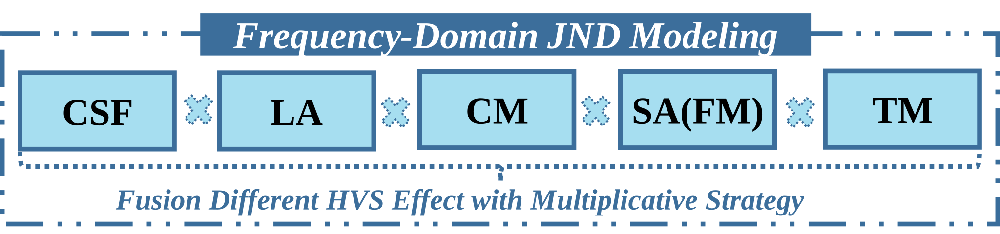

# Method of JND Modeling and Injection in FJNDF-PyTorch

## Frequency-Domain JND Methods

To generalize and unify the various existing frequency-domain JND filter methods, we have designed and implemented a unified model. This model abstracts the core behaviors of frequency-domain JND filter, allowing for the flexible reproduction and combination of different JND algorithms.

The specific implementation of this unified model can be found in the project file: [frequency_jnd_model.py](models/frequency_jnd_model.py).

Its core concept consists of the following three key components:

1.  **HVS Effect Modeling**: This component is used to simulate various perceptual characteristics of the Human Visual System (HVS), such as Luminance Adaptation (LA) and Contrast Masking (CM).
2.  **Fusion of HVS Effects**: When multiple HVS effects are modeled simultaneously, this component is responsible for effectively fusing their impacts to generate a comprehensive JND threshold.
3.  **JND Threshold Injection**: This involves applying the final calculated JND threshold to the original signal (typically DCT coefficients) to remove perceptual redundancy from the image or video, which constitutes the JND filtering process.

We provide highly flexible configuration options for these three components through `.yml` files, allowing users to combine or adjust different HVS models and fusion strategies by modifying the parameters. A general configuration example can be found at: [infer_general_frequency_jnd.yml](../options/inference/infer_general_frequency_jnd.yml).

---

### Modeling

<p align="center">
  
</p>


In our unified model, the frequency-domain JND modeling process typically considers several key effects of the Human Visual System (HVS). As illustrated in the figure, these primary effects include:

*   **CSF (Contrast Sensitivity Function)**
*   **LA (Luminance Adaptation)**
*   **CM (Contrast Masking)**
*   **SA (Spatial Attention / Foveated Masking)**, also known as Foveated Masking (FM)
*   **TM (Temporal Masking)**

These individual HVS effects are generally fused based on a **Multiplicative Strategy** to compute the final, comprehensive JND threshold.

The table below summarizes how several classic frequency-domain JND models from existing literature incorporate and implement the aforementioned effects.

| Model names          | HVS Effect names                                     |
| :------------------- | :--------------------------------------------------- |
| tcsvt_wei_2009 [1]   | CSF, LA, CM, TM (not supported in image coding task) |
| spl_bae_2013 [2]     | CSF, LA                                              |
| tip_bae_2016 [3]     | CSF, LA, CM                                          |
| tob_kang_2023 [4]    | CSF, LA, CM, SA                                      |

Furthermore, a key advantage of our framework is the ability to flexibly configure combinations of different effects through `.yml` files. Under the `effect` section of the `.yml` file, users can specify which effects to include by adding or removing a `type`. The `model` key determines which specific modeling method to use, while `weight` controls the contribution of that effect to the total JND threshold. Finally, `params` is used to define the specific parameters related to the selected model.

Here is an example of the configuration:
```yaml
effect:
    - type: CSF
        model: SPLbae2013
        weight: 1.0
        params: 
        # Specific parameters for the SPLbae2013 CSF model
    - type: LA
        model: TIPbae2016
        weight: 1.0
        params:
        # Specific parameters for the TIPbae2016 LA model
    - type: CM
        model: TCSVTwei2009
        weight: 1.0
        params:
        # Specific parameters for the TCSVTwei2009 CM model
    - type: SA
        model: TOBkang2023
        weight: 1.0
        params:
        # Specific parameters for the TOBkang2023 SA model
```

---

### Injection

Once the JND threshold is calculated, the final step is to "inject" it into the frequency-domain coefficients (typically DCT coefficients). This process modifies the original coefficients to remove perceptual redundancy before transforming them back to the pixel domain via an Inverse DCT (IDCT).

We have implemented several injection strategies, which are summarized in the table below. The desired method can be selected by setting the `target` parameter in the `.yml` configuration file.

| Method names | Description |
| :--- | :--- |
| target == 0 [1] | Randomly add/subtract DCT Coefficients |
| target == 1 [3] | Reduce magnitude of DCT Coefficients, but keeping the sign |
| target == 2 [5] | Weighted magnitude reduction based on frequency-domain index |
| target == 3 [4] | Adaptive frequency-domain Gaussian filter, variance controlled by JND |
| target == 4 [6] | Weighted magnitude reduction based on block classification |

Below are the detailed descriptions for each `target` value:

*   **target = 0**: Randomly add or subtract the JND threshold. This is the original injection method.
    *   Formula: `C' = C + f * T_JND`, where `f` is a random value in {-1, +1}.

*   **target = 1**: Reduce the magnitude of the coefficients (JPEG optimization mode) while keeping the original sign.
    *   Formula: `C' = sign(C) * max(|C| - T_JND, 0)`.

*   **target = 2**: Weighted magnitude reduction based on the frequency-domain index.
    *   Formula: `C' = sign(C) * sqrt(max(C^2 - p(u,v)*JND^2, 0))`.
    *   Note: Coefficients are set to zero if `|C| < JND`.

*   **target = 3**: Adaptive Gaussian filtering. This method uses the JND threshold to control the variance of a Gaussian filter to smooth the coefficients in the frequency domain.

*   **target = 4**: JND smoothing based on block classification. This performs a weighted magnitude reduction according to the characteristics of the image block.

---

## References
[1] Zhenyu Wei and King N Ngan. “Spatio-temporal Just Noticeable Distortion Profile for Grey Scale Image/Video in DCT Domain.” IEEE Transactions on Circuits and Systems for Video Technology, 2009.

[2] Sung-Ho Bae and Munchurl Kim. “A Novel DCT-based JND Model for Luminance Adaptation Effect in DCT Frequency.” IEEE Signal Processing Letters, 2013.

[3] Sung-Ho Bae, Jaeil Kim, and Munchurl Kim. “HEVC-based Perceptually Adaptive Video Coding Using a DCT-based Local Distortion Detection Probability Model.” IEEE Transactions on Image Processing, 2016.

[4] Byeongkeun Kang and Wonha Kim. “Human Perception-oriented Enhancement and Smoothing for Perceptual Video Coding.” IEEE Transactions on Broadcasting, 2023.

[5] Guoqing Xiang, Huizhu Jia, Jie Liu, Binbin Cai, Yuan Li, and Xiaodong Xie. “Adaptive Perceptual Preprocessing for Video Coding.” 2016 IEEE International Symposium on Circuits and Systems (ISCAS), 2016.

[6] Huajie Tan, Guoqing Xiang, Xiaodong Xie, and Huizhu Jia. “Joint Frame-level and Block-level Rate-Perception Optimized Preprocessing for Video Coding.” Proceedings of the 6th ACM International Conference on Multimedia in Asia, 2024.